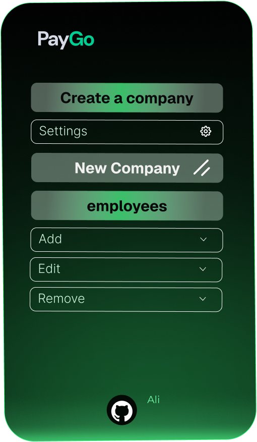

# Payments Stream: Real-Time Payroll with Second-by-Second Payments

- Video:
- Repo: https://github.com/olivmath/paygo.git
- LinkedIn: https://www.linkedin.com/company/paygo-web3
  
# Problem

Waiting weeks to get paid is outdated. Traditional payroll systems follow rigid cycles (bi-weekly or monthly), causing financial stress, reliance on credit, and missed opportunities for employees.
For companies: Slow, costly, and error-prone payroll processes, especially for international payments.
Lack of flexibility: Employees lack access to real-time payments, cryptocurrencies, or rewards for waiting.
No service offers second-by-second payments (Payments Stream).

# Solution
Streaming Payroll in Real-Time

 ✅ Employees to track earnings by the minute and get paid daily
 ✅ Companies to reduce payroll costs and optimize treasury management
 ✅ Secure, transparent, and automated payments


## Landing Page

<div align="center">

</div>

## Dashboard

<div align="center">

</div>

## Registration of new companies

<div align="center">

</div>

## Getting Started

1. Clone the repository

    ```bash
    git clone git@github.com:stack-auth/stack-template.git
    ```

2. Install dependencies

    ```bash
    npm install
    ```

3. Register an account on [Stack Auth](https://stack-auth.com), copy the keys from the dashboard, and paste them into the `.env.local` file. Then, enable "client team creation" on the team settings tab.

    If you want to learn more about Stack Auth or self-host it, check out the [Docs](https://docs.stack-auth.com) and [GitHub](https://github.com/stack-auth/stack).

4. Start the development server and go to [http://localhost:3000](http://localhost:3000)

    ```bash
    npm run dev 
    ```

## Features & Tech Stack

- Next.js 14 app router
- TypeScript
- Tailwind & Shadcn UI
- Stack Auth
- Multi-tenancy (teams/orgs)
- Dark mode

## Inspired by
- [PaltaLabs](https://github.com/paltalabs/hack-meridian)
- [SStream](https://github.com/rahimklaber/SStream)
