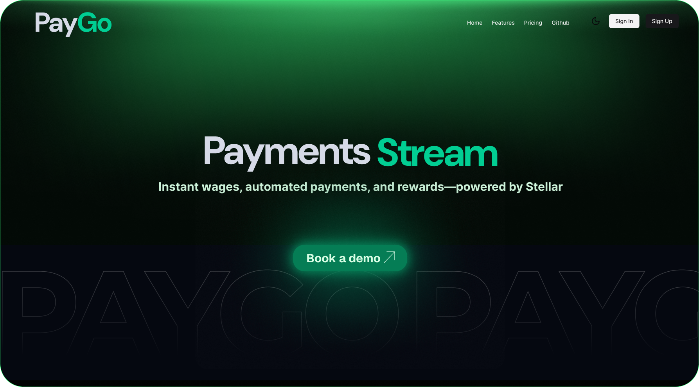
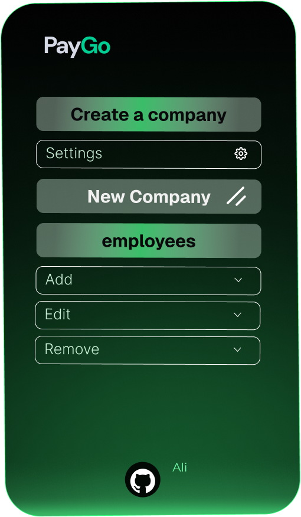
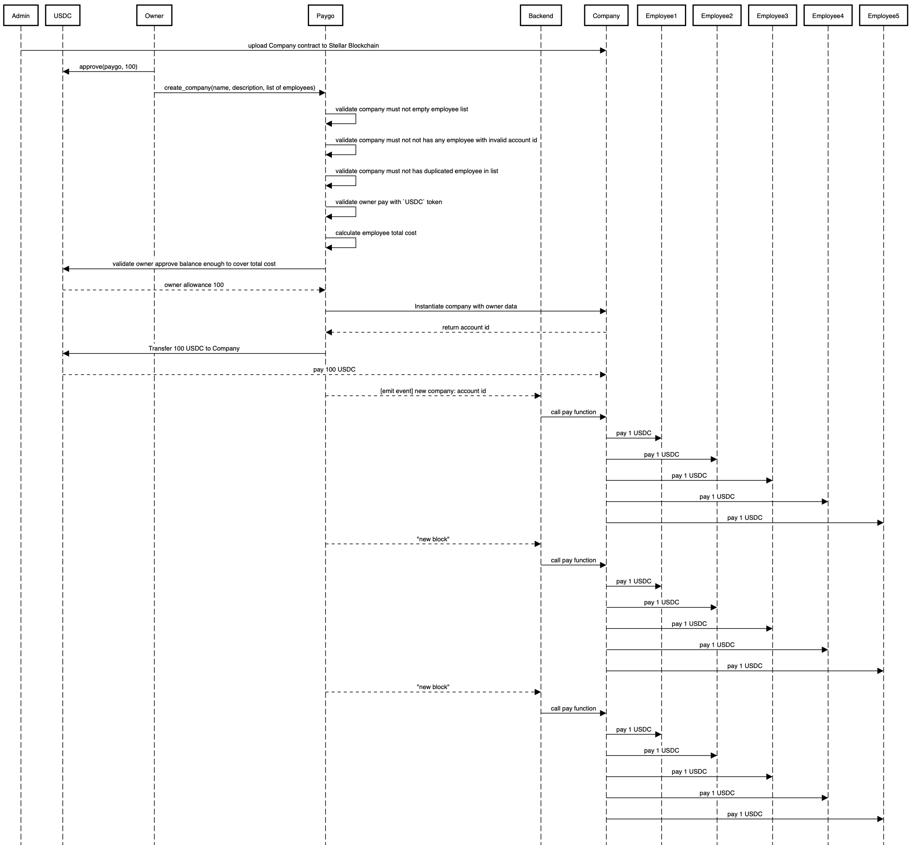
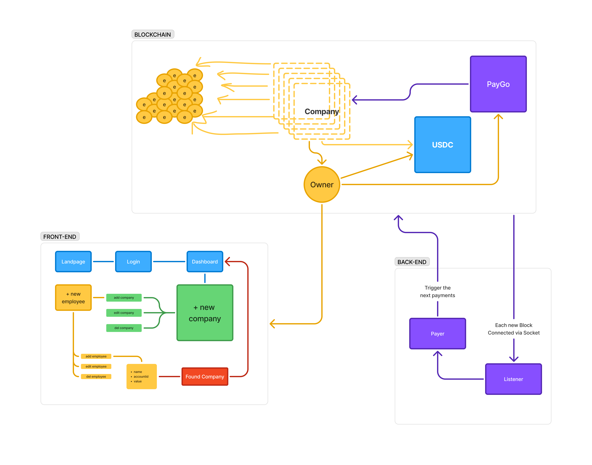
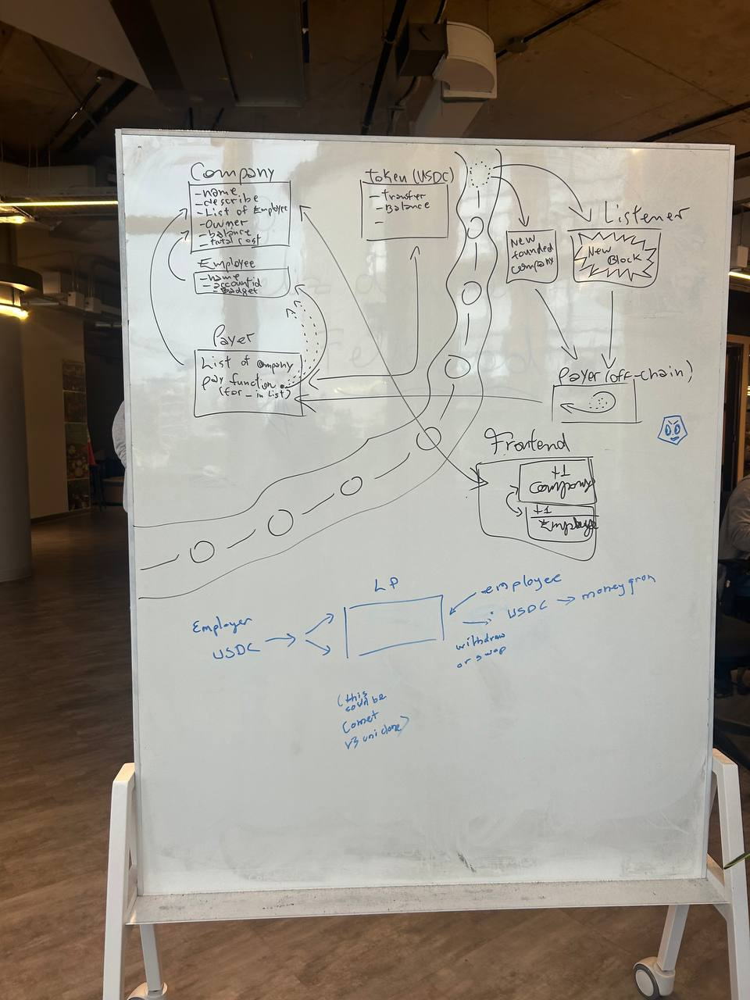

# Payments Stream: Real-Time Payroll with Second-by-Second Payments

- Video:
- Repo: https://github.com/olivmath/paygo.git
- LinkedIn: https://www.linkedin.com/company/paygo-web3

# Problem

Waiting weeks to get paid is outdated. Traditional payroll systems follow rigid cycles (bi-weekly or monthly), causing financial stress, reliance on credit, and missed opportunities for employees.
For companies: Slow, costly, and error-prone payroll processes, especially for international payments.
Lack of flexibility: Employees lack access to real-time payments, cryptocurrencies, or rewards for waiting.
No service offers second-by-second payments (Payments Stream).

# Solution

Streaming Payroll in Real-Time

- ✅ Employees to track earnings by the minute and get paid daily
- ✅ Companies to reduce payroll costs and optimize treasury management
- ✅ Secure, transparent, and automated payments

## Landing Page

<div align="center">

</div>

## Dashboard

<div align="center">

</div>

## Registration of new companies

<div align="center">

</div>

## How to Run (Local)

1. Run full node

```bash
docker run --rm -p 8000:8000 --name stellar stellar/quickstart --local --enable-soroban-rpc
```

2. Install dependencies

```bash
cd frontend && npm i
```

3. Run project

```bash
npm run dev
```

4. Deploy smart contracts

```bash
cd smartcontracts && deploy-local-all.sh
```

## Tech diagrams

- Sequence Diagram



- Architecture Diagram



- Hands-on diagram



## Inspired by

- [PaltaLabs](https://github.com/paltalabs/hack-meridian)
- [SStream](https://github.com/rahimklaber/SStream)
